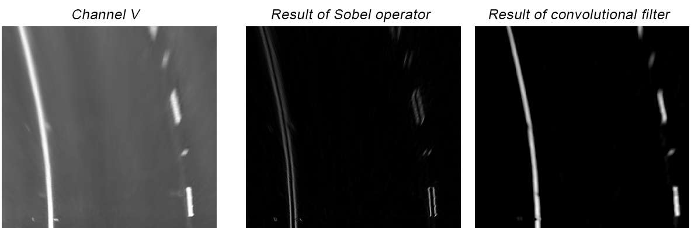
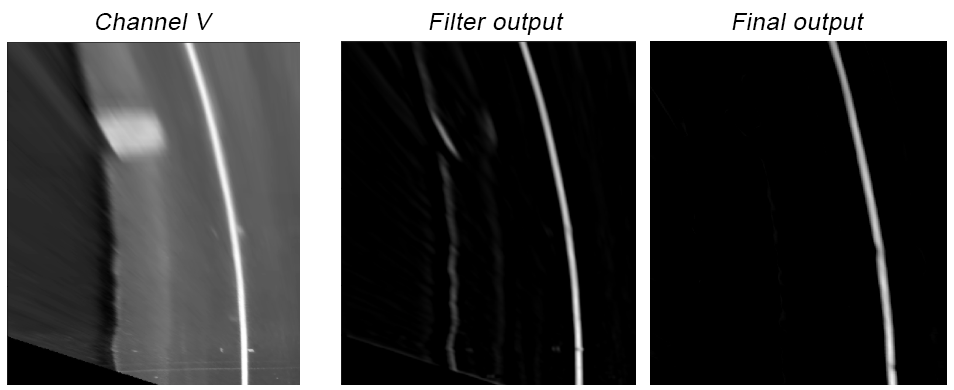
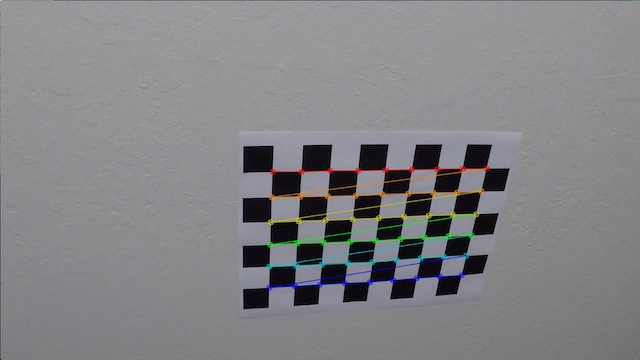
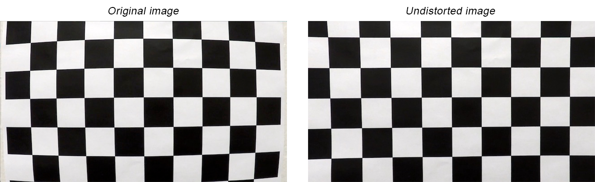
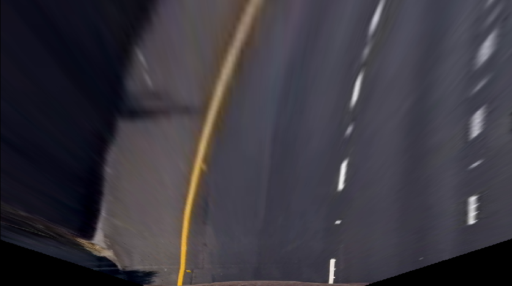
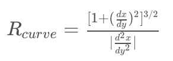
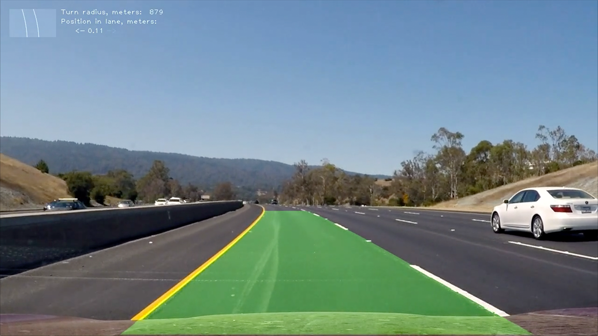
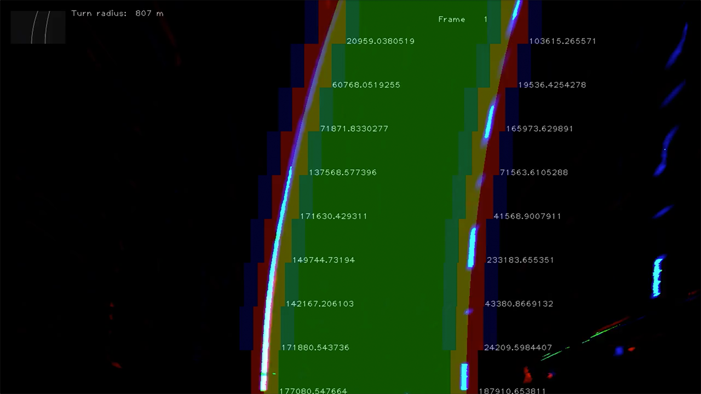
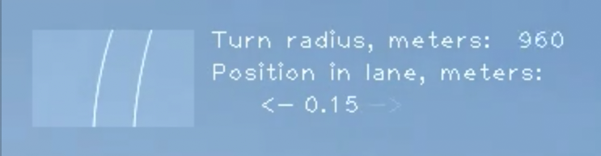

# Advanced Lane Finding Project

## Introduction

The goals / steps of this project are the following:

* Compute the camera calibration matrix and distortion coefficients given a set of chessboard images.
* Apply a distortion correction to raw images.
* Use color transforms, gradients, etc., to create a thresholded binary image.
* Apply a perspective transform to rectify binary image ("birds-eye view").
* Detect lane pixels and fit to find the lane boundary.
* Determine the curvature of the lane and vehicle position with respect to center.
* Warp the detected lane boundaries back onto the original image.
* Output visual display of the lane boundaries and numerical estimation of lane curvature and vehicle position.

## Project structure

Main project files can be found the `python` folder which contains all the scripts for video file processing. A notebook used for transformation methods exploration is located at [exploration/Lane Finding Exploration.ipynb](exploration/Lane%20Finding%20Exploration.ipynb).

Output video files can be found in the `output_video` folder. For the project video output file see [output_video/project_video.mp4](output_video/project_video.mp4).

## Lane Finding Exploration notebook

### Notebook overview

The Exploration notebook was used while working on the project as an experimentation and visualization tool. In the notebook I define transformation functions (cells 4 and 5) and `explore_colorspace` function. `explore_colorspace` converts source images to a specified color space, extracts three individual channels and applies transformations to each channel. Then all the images are drawn in the notebook itself.

Further in the notebook I load source data (cell 7) and call `explore_colorspace` with various target color spaces and threshold levels (cells 8-11). This block was used to experiment with different threshold levels and different color spaces to find the combination that gives the best isolation of lane lines.

Finally I apply transformations that I selected as best performing to a series of images taken from source video clip (cell 12). For each image I draw an undistorted and unwarped birds-eye view image, then the results of transformations are drawn in different RGB color channels of a single image and finally the one-channel grayscale image used by sliding window algorithm is drawn.

### Image transformations

The first transformations I experimented with were converting an image to different color spaces, apply threshold to color channels and apply Sobel operation in the horizontal direction in combination with the threshold. Functions `sobelx` and `threshold` (cell 4) apply these transformations to a single channel.

The function `sobelx` takes an absolute value of the Sobel operator. I have noticed that this transformation produces two parallel lines in the output image that correspond to left and right edges of a lane line. See illustration below which shows V channel of an image transformed to HSV color space on the left and output of Sobel operator in the middle. All the lines are doubled in Sobel output because absolute value of Sobel operator picks two gradients corresponding to left and right edge of a line.

I wanted to combat that unwanted side effect and developed a convolutional filter which output is shown on the right side of the illustration. As shown on the image, filter output contains lane lines without doubling effect.

The filter is implemented by `one_ch_sobel_filter` function (cell 5).

The first step in the function is Sobel operator in horizontal direction with kernel size 25. The size was selected by measuring average lane line width in a birds-eye view image which is 12 pixels. Doubling the number gives us kernel size 25. Such a large kernel produces a peak in the output value of the operator close to lane line edges. The peak is positive on one edge and negative on another edge.

The next step is to apply 2D convolution to the result of Sobel operator and a filter vector comprised of nine values `-1` followed ten values `0` and nine values `1` (`lane_filter_window` variable). This filter vector was constructed to capture peak outputs of Sobel operator whose distance from each other may vary due to different lane line width. The result is stored in `lane_signal` variable.

These steps produce good result, however they also captures transition from shade area to sunny area. This is illustrated on the image below which contains part of the V channel image on the left and corresponding output of the steps described above in the center. Notice that the output contains both solid lane line and a thinner line in the left part caused by shade-to-light transition.

To suppress unwanted output caused by differences in channel values in shade and lit areas I have added another convolution operation, this time to convolve source channel matrix with a larger filter vector `shadow_filter_window`. The filter vector contains ten values `-1` followed by forty values `0` and ten values `1`. The size of the filter vector was chosen to be larger than the filter in the first convolution operation to avoid interference.

Convolution of source matrix and `shadow_filter_window` produces high values along transition from shade to lit areas of the image. I take an absolute value of the result of convolution to capture both shade-to-light and light-to-shade transitions. Then I subtract the output of operation from the line `lane_signal` computed on earlier steps. This produces an output cleaned from shade-to-light transition artifacts. The final output of the filter is shown in the image above on the right.

### Exploring color spaces

I have experimented with converting images to different color spaces: HSV, HLS, YUV and LAB. I tried to apply different threshold levels to channels, apply Sobel operator followed by threshold and apply convolutional filter I have developed. After some experiments I decided not to apply threshold to the convolutional filter output, but to normalize it and use floating point values. I think this helps at a later stage to detect line center with the help of a sliding window function.

### Applying selected transformations

After I have experimented enough with different color channels and different transformations I was able to come up with a combination of three channels and three transformations applied to them to produce final grayscale channel that is used by sliding window function (cell 12).

The first channel is S channel from HSV color space with a convolutional filter applied to it. The second channel is V channel from HSV color space with a low threshold 220 and high threshold 255. The third channel is L channel from LAB color space with a convolutional filter.

All three channels are summed up and used as the final output.

## [Rubric](https://review.udacity.com/#!/rubrics/571/view) Points

Below I will consider the rubric points individually and describe how I addressed each point in my implementation.  

---

### Camera Calibration

Camera calibration is performed by `calibrate_camera` function in [calibration.py](python/calibration.py) file. In that function I iterate over all calibration files (line 30), use `cv2.findChessboardCorners` to locate chessboard corner coordinates (line 39) and save successfully found coordinates in `objpoints` and `imgpoints` lists. See below an example of calibration image with chessboard corners drawn over it.

Then I call `cv2.calibrateCamera` to get camera calibration parameters. See below an example of original and undistorted (corrected) image obtained with the help of function `cv2.undistort`.

To speed up execution, camera calibration parameters are stored into `calibration.p` file and retrieved on subsequent program runs by the function `get_calibration_params` ([calibration.py](python/calibration.py), line 47).

### Distortion correction and perspective transformation

Both distortion correction and perspective transformation are performed by `PerspectiveTransformer` class ([distortion.py](python/distortion.py)). Its function `unwarp` calls `cv2.undistort` and `cv2.warpPerspective` to get a birds-eye view image. Additionally, the class implements `warp` function to convert a birds-eye view image back to a perspective image. This is used to add visualization to the video clip.

cv2 functions use camera calibration parameters produced earlier as well as perspective transform computed by `cv2.getPerspectiveTransform` (lines 38-39). `getPerspectiveTransform` takes pairs of coordinates of source and destination points. Source points were found by manually looking at coordinates of 4 lane lines points in an image where the lane goes straight ahead without turns. They are stored in the `src` variable (lines 23-28). Destination points are stored in the `dst` variable and are computed dynamically to be located at 10% of image height value from top and bottom borders and at 35% or image width value from left and right border (lines 30-36 of [distortion.py](python/distortion.py)).

An example of undistorted birds-eye view image is provided below.

### Transformation pipeline

Lane detection algorithm requires a birds-eye view image on input. Therefore the pre-processing step to undistort and unwarp an image is performed by `PerspectiveTransformer.unwarp` ([distortion.py](python/distortion.py)).

The next step is to transform a color image of a video frame to a single channel that can be used by the sliding window algorithm. There are two implementations of this processing step in the project, `PipelineHls` ([pipeline_hls.py](python/pipeline_hls.py)) and `PipelineConvolution` ([pipeline_convolution.py](python/pipeline_convolution.py)).

`PipelineHls` was used in the first series of experiments, final result was produced with the help of `PipelineConvolution`.

`PipelineConvolution` contains steps described earlier in the *"Lane Finding Exploration notebook"* section. `PipelineConvolution.apply` (line 67 of [pipeline_convolution.py](python/pipeline_convolution.py)) converts image to HSV (line 71) and LAB (line 72) color spaces, extracts channels S, V and L (lines 75-77), then applies convolutional filter to channels S and L and threshold to channel V (lines 79-82). Threshold transformation has low value of 220 and high value of 255. Then the results are summed up to the `output_channel` variable and scaled to have maximum value of 255 (lines 84-86). Additionally, a visualization image is produces (lines 88-89).

The rest of the file was copied from the notebook, functionality of the code has been described above when discussing the notebook.

### Sliding window algorithm

The output of the transformation pipeline is passed to the sliding window algorithm. `SlidingWindow.find_window_centroids` is the entry point of the algorithm (line 64 of [window.py](python/window.py)). The function accepts single channel image and centroids found on a previous step.

If centroids from a previous step are provided, the function takes the first pair (left and right) of centroids as starting points for search (lines 81-84). If no previous centroids are provided (for example, if this is the first video frame), then the function calls `_find_initial_centroids` (line 86) and appends the results to appropriate lists.

`_find_initial_centroids` (lines 45-62) takes a horizontal image slice of 1/4 of the height at the bottom and squashes it vertically into a one-pixel row by summing up all the pixel values in each column with the same *y* coordinate. Then it applies convolution to the leftmost 3/4 of the row and a window, as well as rightmost 3/4 of the row and a window. The window (line 24) has 50 values and contains gaussian distribution with standard deviation 25.

I changed the window with all values set to `1` which was presented in the lesson to a window with a gaussian distribution to allow convolution better pick centers of lines. With all window values equal to `1` convolution produced equal output values in the whole range where line pixels in the source image overlap with the window. With the gaussian distribution the output value reaches its maximum at line center. Eventually this results in a more accurate line detection.

`_find_initial_centroids` applies weights to convolution output values. The weights have values of `1` in the center of the frame but gradually fade off in the left and right 3/8 of the image. Applying the weights decreases the value of non-zero pixels located close to the edges of the image where lane line is unlikely to be found. This lets to pick the lane line that is closer to the car, e.g. in case when the road has multiple lanes and more than one lane line is visible on either left or right side.

Additionally, I changed convolution mode from default *'full'* to *'same'*. This allows to get rid of the offset when computing indices as convolution output is aligned with input now.

Eventually `_find_initial_centroids` uses `argmax` (lines 54, 59) call to find the index where convolution is at maximum. This corresponds to line center. Additionally, the function takes the actual maximum values of convolution as a confidence metric. This is used later in the code.

When initial centroids are located, `find_window_centroids` iterates over layers of image from bottom to top and locates lane lines on each layer. Similarly to `_find_initial_centroids`, it computes convolution of the layer with the window (line 100) and calls `_find_centroid` to find left and right centroids (lines 102-104).

`_find_centroid` (lines 38-43) search within +/- 50 pixels from *x* centroid coordinate found on a lower level and returns *x* coordinate where convolution is at maximum. Actual values of the convolution are taken as confidence metric (lines 106-107) by `find_window_centroids`.

When new centroid coordinates are found, `find_window_centroids` checks how confident the algorithm is that the new values represent new centroids. The confidence metric is a sum of all pixel values in a single one-pixel column. If pixels are dark (i.e. contain no lane line or barely visible lane line) then confidence level is low. If pixels are light, confidence level is high.

The function compares computed confidence with a threshold (lines 109, 119). If confidence is below threshold then the function tries to use centroid coordinates from the same horizontal layer found in a previous video frame (lines 112, 122). If no previous centroid coordinate is available, then low-confidence centroid coordinate is used (lines 115, 125). In case confidence is above threshold, new centroid coordinates are used (lines 117, 127). Empirically I have found that threshold value of 15000 produces good results.

Finally the function adds centroid coordinates and confidence values to output lists (lines 129-137).

### Computing continuous sequence of coordinates

Sliding window algorithm produces 9 pairs of centroid coordinates. The algorithm slices the image into 9 horizontal layers, one pair of coordinates is produced on each layer for the left and right lane line.

These centroid coordinates are used to build a continuous sequence of coordinates with *y* coordinate ranging from 0 to image bottom.

Class `LanePixelsComputer` (lines 11-35 in [tracker.py](python/tracker.py)) is doing this operation in its function `compute_from_centroids`. The function takes centroids coordinates and computes a pair of coordinates for each value of *y*.

### Fitting the curve

Computed continuous sequence of coordinates of lane line points is passed to `LaneCurve.accept` function (line 53 of [curve.py](python/curve.py)). The function uses `np.polifit` to compute A, B and C parameters of a second-order polynomial that fits the points. The parameters are computed both in terms of points and in terms of meters. Parameter values in terms of points are stored in variables `a`, `b` and `c` (line 62), parameter values in terms of meters are stored in variables `ma` and `mb` (line 63). To convert from pixel space to metric space two constants are used: `X_MPP` and `Y_MPP` which contain meters per pixel in horizontal and vertical dimensions respectively.

Computed parameters A, B and C are added to averaging filters, one filter per value (see lines 47-51, 65-69). Averaging filter is implemented by `AveragingFilter` class (lines 4-28 of [curve.py](python/curve.py)). The filter accumulates last 5 values of a parameter and computes their average.

Computing average of the parameters allows to avoid sharp movements of the discovered lane lines when video source is shaking frame to frame.

In addition to fitting the curve, `LaneCurve` class implements functions to get additional information. `get_x` function (lines 71-82) computes *x*-coordinates for a range of *y*-coordinates based on the currently fitted curve. `get_x` uses variables `a`, `b` and `c` to compute point coordinates and returns the result in terms of pixels.

Function `get_radius` (lines 84-93) computes road curvature radius. It uses the formula provided below. `get_radius` performs computation using variables `ma` and `mb` to get result in terms of meters.

Function `get_position` (lines 95-106) computes position of the vehicle in lane and returns the computed result in terms of meters. Because the function uses variables `c` that represent left and right curve using instances of `AveragingFilter`, computed value is averaged across last 5 frames.

### Visualizing results

File [visualization.py](python/visualization.py) contains various classes that visualize computation results.

`VisualizationImageLayer` (lines 5-19) implements a memory buffer to draw visualization artifacts on. It provides function `get_buffer` (lines 13-14) which returns in-memory buffer to draw on (a numpy array) and `apply` (lines 16-19) to combine layer content with the target image. `apply` uses transparency `0.5` when combining images to make visualization artifacts less distracting from the main image.

`LaneVisualization` (lines 22-65) draws a semi-transparent green region between detected lane lines, this way representing a drivable lane surface in front of a car. The class doesn't use `VisualizationImageLayer` because it applies perspective transformation, which would distort output of other visualization classes if a single common image buffer was used. The class draws a lane mask on an empty image in birds-eye view system of coordinates with the help of `_get_lane_mask` function (lines 31-53), then optionally invokes `transformer.warp` to restore image perspective (lines 60-62) and finally combines the result with source image (line 65). An example of output image with visualized lane is provided below.

`SearchWindowVisualization` (lines 68-141) draws search windows, search margin and confidence values on a birds-eye view image. The result of visualization can be seen on the image below. Search windows are drawn in the red channel, search margins are draw in the blue channel. Confidence values are printed next to each detected centroid. The class does not use `VisualizationImageLayer` because it uses all three color channels, while `VisualizationImageLayer` provides a single channel only.

`MapThumbnailVisualization` (lines 144-189) draws a thumbnail view of detected lane lines in birds-eye view perspective. The class draws left and right lines independently and it helps to see that sometimes detected lines are not exactly parallel to each other, for example when the car bumps on uneven road surface. The class applies anti-aliasing (lines 181-189) to draw smooth lines.

`TurnRadiusVisualization` (lines 192-209) prints the value of road curvature next to thumbnail. `TurnRadiusVisualization.draw` takes both left and right `LaneCurve` instances, calls their `get_radius` function and averages the result.

`PositionVisualization` (lines 212-241) prints vehicle displacement form the center of the lane. Displacement is printed as a numerical value representing distance in meters and arrows that show direction of displacement (either left or right).

An example of thumbnail, printed radius and position in lane is provided below.

`FrameNumberVisualization` (lines 244-259) prints frame number starting from 1 on each processed frame. This helped to debug the algorithm by inspecting computed values for a specific frame. Printed frame number can be seen on debug visualization above.

### Processing video frames

Class `LaneTracker` (lines 38-153 of [tracker.py](python/tracker.py)) merges different parts of processing pipeline together. It takes transformation pipeline and visualization parameters as constructor arguments (line 41). Upon the first call of `process_frame` function (line 124) it calls `_initialize` (lines 132-134). The function `_initialize` (lines 60-76) instantiates various classes required to process data and visualize results. All these classes were described above.

`process_frame` calls `unwarp` (line 138) to get a birds-eye view image and then calls `apply` function to run image transformation pipeline. This gives a single channel with lane lines and a visualization image for debugging purposes. Then the function calls `_apply_single_frame_sliding_window` (lines 141-142) to detect lane lines.

`_apply_single_frame_sliding_window` calls `sw.find_window_centroids` to run the sliding window algorithm (lines 109-110) and stores detected centroids to pass them to the algorithm on the next iteration, i.e. next frame (line 111). Then it calls `compute_from_centroids` (lines 116-117) to get continuous sequences of left and right centroid pixels and finally passes computed values to `line_curve_left.accept` and `line_curve_right.accept`.

After calling `_apply_single_frame_sliding_window` the function `process_frame` invokes `_visualize` (lines 149-150) to produce output image.

`_visualize` (lines 78-100) calls `draw` functions of different visualization classes according to configuration parameters passed to constructor. It uses `VisualizationImageLayer` (line 89) to draw visualization artifacts on.

### Processing video file

Video file as a whole is processed by `VideoProcessor` class ([video.py](python/video.py)). The class opens video file (line 21), optionally selects a subclip (lines 22-23) and calls `fl_image` (line 24) to process each video frame. Finally processed file is saved to disk (line 25).

Output video file is located at [output_video/project_video.mp4](output_video/project_video.mp4)

---

### Discussion

The project works well on the `project_video.mp4` file, however there are ways to improve its performance.

The project fails on challenge video files. The output produced for the challenge video is available as [output_video/challenge_video.mp4](output_video/challenge_video.mp4). The project gets fooled by non-lane marks on the road and it does not detect lanes reliably in the far perspective. The output for `harder_challenge_video.mp4` is completely unusable and therefore is not provided.

The project assumes that every video frame contains both left and right lane lines and that they can be detected. This is a strong assumption for the very first frame since it may affect subsequent frames via the mechanism of re-using centroid values in case of low confidence. The project does not implement *"search mode"* where it would look for high-confidence detection before accepting any results. In the absence of *"search mode"* the project does not stop tracking lane lines when confidence falls to a low level.

The project does not work when one of the lane lines is not visible, as in some frames of `harder_challenge_video.mp4`.

Considering the above, the following improvement steps can be taken:

1. Image transformation pipeline can be enhanced to distinguish lane lines from non-lane marks;
1. *"Search mode"* can be implemented for scenarios when line detection confidence is low;
1. Different lane detection mechanism can be implemented for the scenarios when lane lines cannot be detected. This can be one or more of the following:
    1. If a least one line (either left or right) is confidently detected, position of the second line can be assumed based on the standard width of a lane;
    1. If line is not detected, the project can look for road edge and use it instead;
    1. Detecting lane lines can be replaced or augmented by detecting lane area in front of the car (i.e. drivable surface).